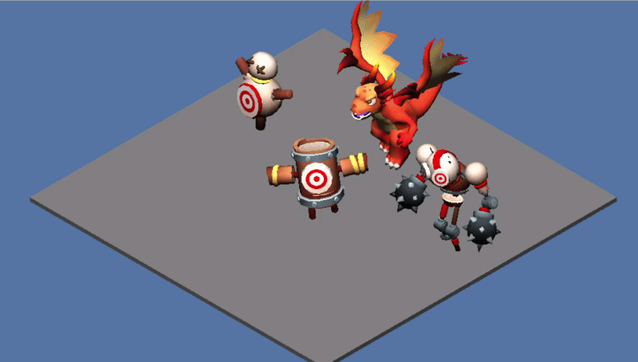

# Rogue Vita 🎮

Rogue Vita project aims to create an isometric rogue-lite game using a custom engine!

  
  

<i>Player controller with animations using custom engine and <code>dvl</code> framework</i>

## dvl 🛠️

The core framework, `dvl`, is used and developed alongside the engine. It separates the game from low-level systems by providing graphics, input, time, logging, tweening, mathematics, animation and tools for assets.

It enables cross-platform development and currently supports the `PlayStation Vita` via `VitaGL` and `PC` via `OpenGL`. It can be extended to support more platforms, `SDKs` or graphics `APIs`.

## Implemented features

- 🎨 3D rendering with textured meshes and Phong lighting
- 🧩 Entity-component framework
- 🎮 Simple player controller
- 📦 Custom asset cookers
- 🧮 Skeletal animation
- 💻 PC and PS Vita support

## Planned Next Features 🚀

- 🎮 Basic gameplay
- 🧭 NavMesh pathfinding
- ✨ Particle system

## Build & Run

VitaSDK, VitaGL, Make, Assimp, GLFW, GLEW, and a C++17 compiler are required.

- Vita: `make run`
- Vita emulator: `make emul`
- Desktop (Linux): `make desktop`
- Asset cooking: `make cook`
- Test running: `make test`
