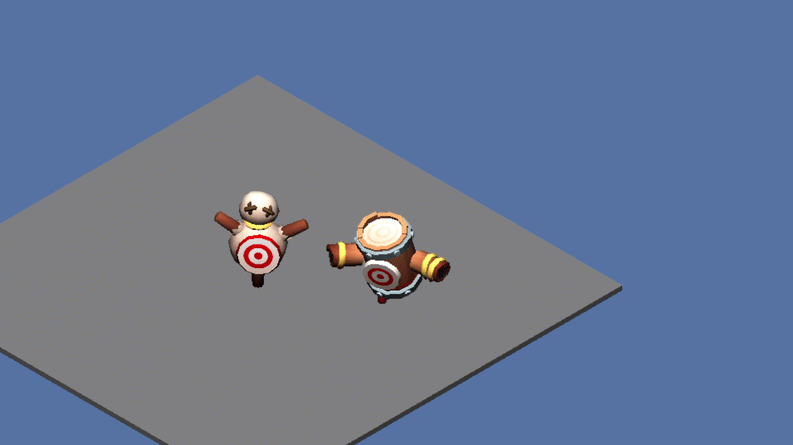

# Rogue Vita 🎮


Rogue Vita is an experimental 3D isometric rogue-lite game built for the PlayStation Vita using C++ and VitaGL.


*Rogue Vita - Current state of the project!*

## dvl 🛠️

`dvl` is a lightweight and reusable C++ API developed alongside Rogue Vita. It separates the game from low-level systems by providing graphics, input, time, logging, tweening, math, and asset tools.

Its public API is available through `#include <dvl/dvl.h>` and currently uses VitaGL as its rendering backend. The backend abstraction also allows new implementations to be added in the future, making support for other platforms possible.

## Features

- 🎨 3D rendering with textured meshes and Phong lighting
- 🧩 Entity and component gameplay framework
- 🎮 Player movement, dash, and spring-arm camera
- 📦 Custom mesh and texture cooker
- 🧮 Animation-ready math library

## Planned Next Features 🚀

- 🦴 Animation framework available in `dvl`

## Project Structure 📁

```text
Rogue-Vita/
├── asset/          Game assets and shaders
├── dvl/            Reusable engine API, tests, and tools
│   ├── include/    Public dvl headers
│   ├── src/        Runtime implementation
│   ├── tests/      Unit tests
│   └── tool/       Asset cooker
├── include/        Game and engine headers
└── src/            Game and engine implementation
```

## Build

VitaSDK, VitaGL, Make, and a C++17 compiler are required.

```bash
git clone https://github.com/ldevillard/Rogue-Vita.git
cd Rogue-Vita
make
```

Run the tests with:

```bash
make test
```
