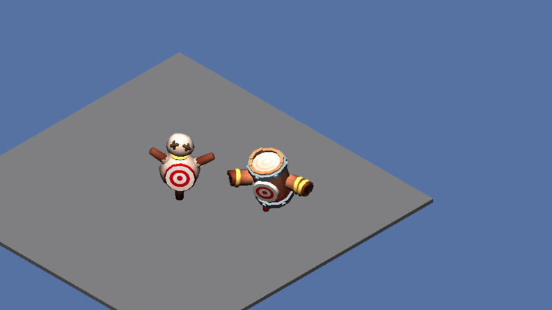
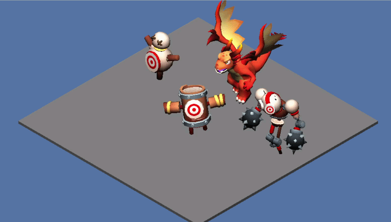

# Rogue Vita 🎮


Rogue Vita project aims to create an isometric rogue-lite game using a custom engine!

<p>
  
  
</p>
<p align="center"><i>Player controller with animations using custom engine and <code>dvl</code> framework</i></p>

## dvl 🛠️

The core framework, `dvl`, is used and developed alongside the engine. It separates the game from low-level systems by providing graphics, input, time, logging, tweening, mathematics, animation and tools for assets.

It enables cross-platform development and currently supports the `PlayStation Vita` via `VitaGL` and `PC` via `OpenGL`. It can be extended to support more platforms, `SDKs` or graphics `APIs`.

## Implemented features

- 🎨 3D rendering with textured meshes and Phong lighting
- 🧩 Entity-component framework
- 🎮 Simple player controller
- 📦 Custom asset cookers
- 🧮 Skeletal animation
- 💻 PC and PS Vita support

## Planned Next Features 🚀

- 🎮 Basic gameplay
- 🧭 NavMesh pathfinding
- ✨ Particle system
- 🪵 Physics API

## Private source assets

Models, textures and animations live in the private [Rogue-Vita-Asset](https://github.com/ldevillard/Rogue-Vita-Asset) repository, mounted at `asset/source` as a Git submodule. Access to that repository is required to download the assets. Shaders stay in this repository; generated files in `asset/cooked` remain ignored.

After cloning this repository, download the pinned asset version:

```sh
git submodule update --init --recursive
```

To publish asset changes, commit and push them from the submodule first, then update the reference in this repository:

```sh
git -C asset/source switch main
git -C asset/source pull --ff-only origin main
git -C asset/source add -- animation mesh texture
git -C asset/source commit -m "Update source assets"
git -C asset/source push -u origin main
git add asset/source
git commit -m "Update private asset reference"
git push
```

## Build & Run

VitaSDK, VitaGL, Make, Assimp, GLFW, GLEW, and a C++17 compiler are required.

- Vita: `make run`
- Vita emulator: `make emul`
- Desktop (Linux): `make desktop`
- Asset cooking: `make cook`
- Test running: `make test`
